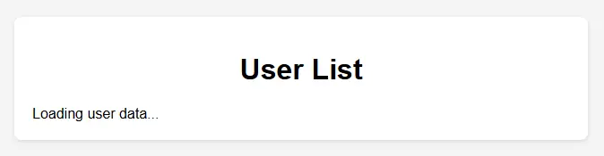
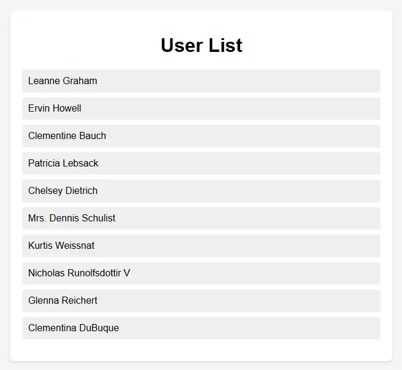

# Form-Creation-Validation

## 📋 Description

This project is part of the **ALX Web Development** program. It covers two core assignments:

---

### 🧩 Assignment 0: Form Creation & Validation

Build and validate a user registration form using **HTML**, **CSS**, and **vanilla JavaScript**.

#### Features:

- User form with **username**, **email**, and **password** fields.
- Live **client-side validation** with dynamic error/success messages.
- Feedback using JavaScript for:
  - Minimum input length
  - Email format check
  - Password requirements

---

### 🔗 Assignment 3: Fetching User Data from API

Implement a responsive page that asynchronously fetches and displays user data from a **public REST API** using JavaScript.

#### Features:

- Fetches user names from `https://jsonplaceholder.typicode.com/users`.
- Displays data as a clean list with loading/error states.
- Graceful error handling using `try...catch`.
- Fully styled UI using custom CSS.

---

## 📁 Project Structure

```plaintext
Form-Creation-Validation/
├── index.html # Registration form (Assignment 0)
├── style.css # Form styling
├── script.js # Form validation logic
├── fetch-data.html # API Fetch page (Assignment 3)
├── fetch-data.css # Styling for API UI
├── fetch-data.js # Async fetch + error handling
└── preview/ # Screenshots & demo previews
```

---

## 🚦 Assignment 0: Validation Rules

- **Username**: Minimum 3 characters
- **Email**: Must include `@` and `.` symbols
- **Password**: Minimum 8 characters

## 🚀 How to Use

1. Clone the repo:
   ```bash
   git clone git@github.com:edunwant42/Form-Creation-Validation.git
   cd Form-Creation-Validation
   ```


2. Choose the assignment you want to explore:
 - For **Assignment 0**: Open `index.html` in your browser.
 - For **Assignment 3**: Open `fetch-data.html` in your browser.

### 🧩 Assignment 0: Form Creation & Validation

1. Open the `index.html` file in your browser:
 - You can double-click it, or right-click → "Open with" → Your browser.

2. Try entering:
 - A **short username**, incorrect **email format**, or weak **password** to see live validation.
 - Correct inputs to simulate a successful registration.

3. You can edit `script.js` to tweak the validation logic if needed.

---

### 🔗 Assignment 3: Fetching User Data from API

1. Open the `fetch-data.html` file in your browser.

2. On load, the page will:
 - Show `Loading user data...`
 - Then fetch names from `https://jsonplaceholder.typicode.com/users`

3. If the request is successful:
 - A styled list of user names will appear on the page.

4. If an error occurs:
 - A message will show: `Failed to load user data.`

---

## 🖼️ Previews

### 🧪 Form Validation Previews (Assignment 0)

#### 🔸 Combined View: All Errors vs Success

<div align="center">
<table>
  <tr>
    <th>All Errors Displayed</th>
    <th>Successful Registration</th>
  </tr>
  <tr>
    <td></td>
    <td></td>
  </tr>
</table>
</div>

#### 🔹 Individual Validation Errors

<div align="center">
<table>
  <tr>
    <th>Username Error</th>
    <th>Email Error</th>
    <th>Password Error</th>
  </tr>
  <tr>
    <td></td>
    <td></td>
    <td></td>
  </tr>
</table>
</div>

---

### 🌐 API Fetch Previews (Assignment 3)

<div align="center">
<table>
  <tr>
    <th>Before JavaScript Loaded</th>
    <th>After Data Fetched</th>
  </tr>
  <tr>
    <td></td>
    <td></td>
  </tr>
</table>
</div>

---

## 🔐 Author

This project was completed by edunwant42 as part of the ALX Software Engineering program.
