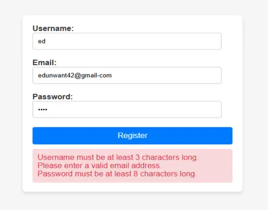
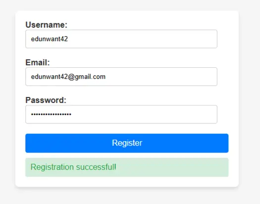
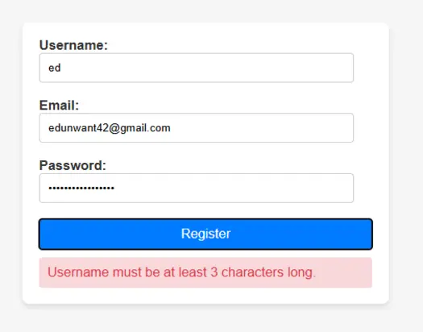
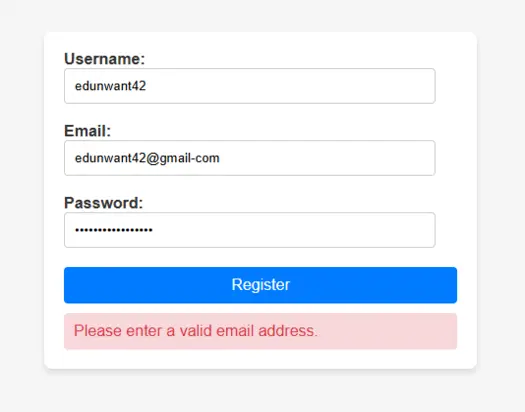
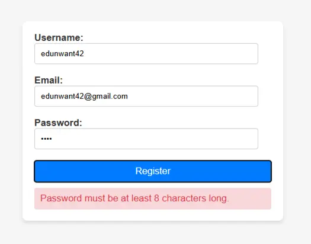

# Form-Creation-Validation

## 📋 Description

This project is part of the **ALX Web Development** program. The task focuses on creating a user registration form and implementing **client-side form validation using JavaScript**.

It includes:
- A styled HTML form with username, email, and password fields.
- Validation logic for each field (e.g. minimum length, email format).
- Dynamic feedback to the user based on input correctness.

---

## 📁 Project Structure

```
Form-Creation-Validation/
├── index.html # Provided HTML form
├── style.css # Provided CSS for form styling
└── script.js # JavaScript validation (implemented)
```

---

## 🧠 Validation Rules

- **Username**: Must be at least 3 characters long.
- **Email**: Must include "@" and "." symbols.
- **Password**: Must be at least 8 characters long.

All validations are handled on the client side using **vanilla JavaScript**.

---

## 🚀 How to Use

1. Clone the repository:
   ```bash
   git clone git@github.com:edunwant42/Form-Creation-Validation.git
   cd Form-Creation-Validation
   ```
2. Open index.html in your browser.

3. Try filling the form with various input to see validation messages.


### ✅ Sample Output
If all inputs are valid:

`
"Registration successful!"
`

If there are errors, all relevant messages will be shown:

```
- Username must be at least 3 characters long.

- Please enter a valid email address.

- Password must be at least 8 characters long.
```

### 🖼️ Preview

#### 🔸 Combined View: All Errors vs Success

<div align="center">

<table>
  <tr>
    <th>All Errors Displayed</th>
    <th>Successful Registration</th>
  </tr>
  <tr>
    <td></td>
    <td></td>
  </tr>
</table>

</div>

---

#### 🔹 Individual Validation Errors

<div align="center">

<table>
  <tr>
    <th>Username Error</th>
    <th>Email Error</th>
    <th>Password Error</th>
  </tr>
  <tr>
    <td></td>
    <td></td>
    <td></td>
  </tr>
</table>

</div>


## 🔐 Author

This project was completed by edunwant42 as part of the ALX Software Engineering program.

